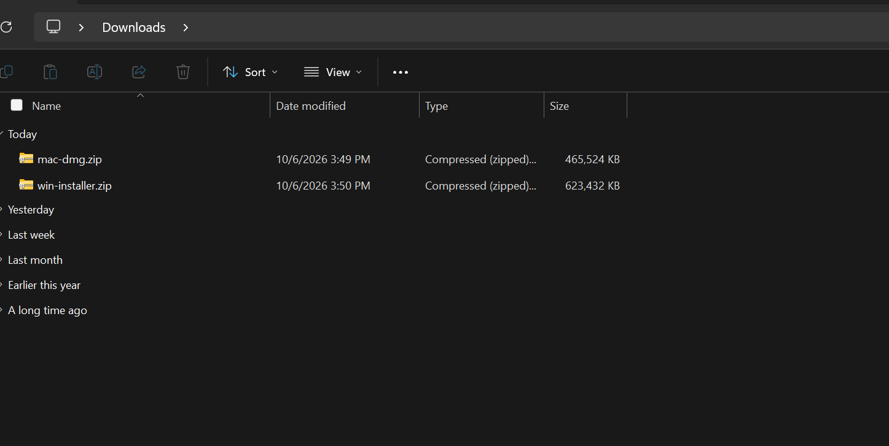
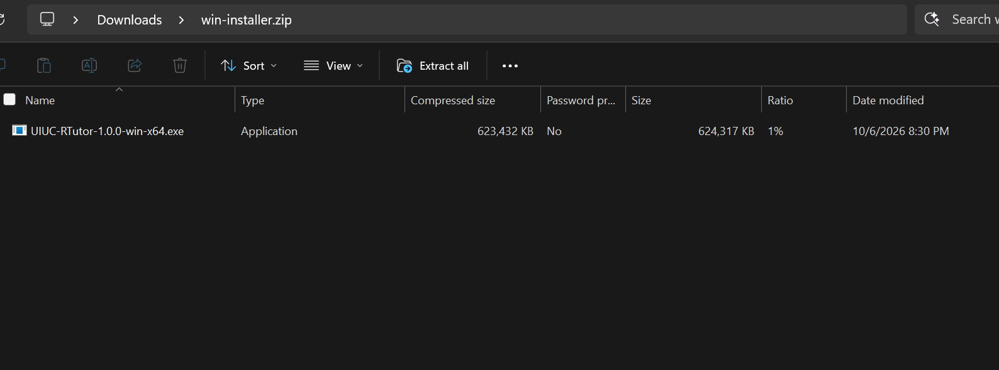
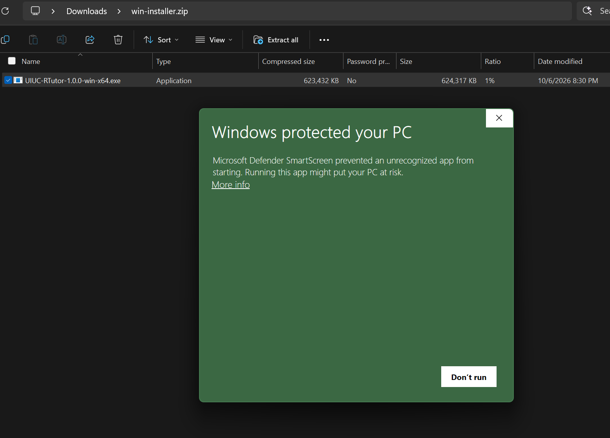
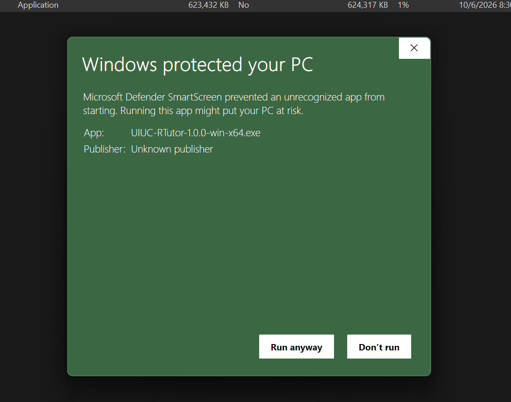
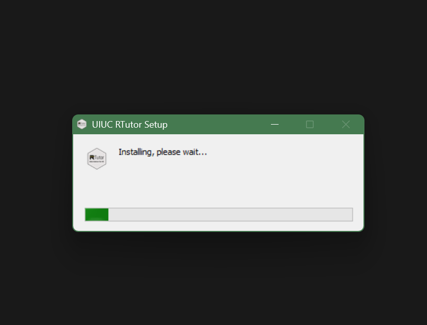
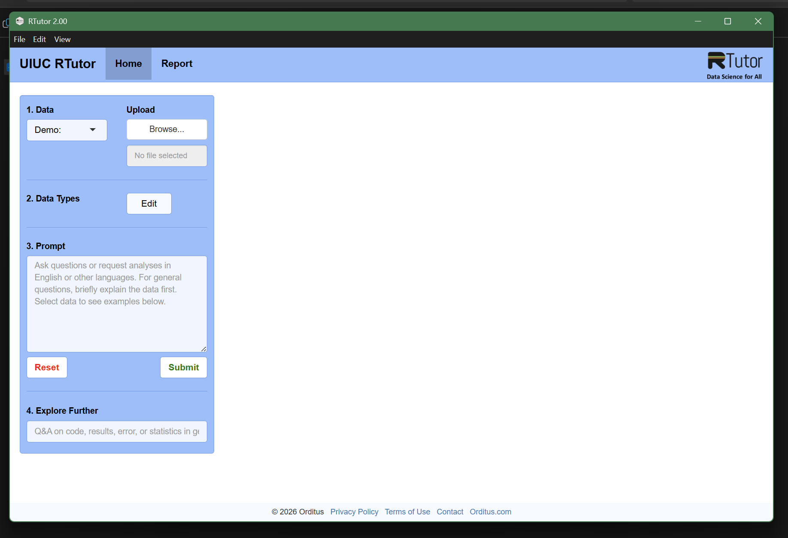

# Installing UIUC RTutor Desktop

UIUC RTutor runs on your own computer. It includes everything it needs (R and all the packages), so you don't need
to install R or anything else first. You do need an internet connection while you use it.

**Requirements**
- **Mac:** Apple Silicon (M1, M2, M3, M4 or newer) running macOS 12 Monterey or later. To check, open the Apple menu
  → **About This Mac**: the "Chip" line should say Apple M-something.
- **Windows:** Windows 10 or 11, 64-bit.
- Intel Macs, Chromebooks and Linux are not supported.

You also need a few gigabytes of free disk space.

Download the installer from the [UIUC RTutor download page](https://github.com/gexijin/RTutor/releases?q=uiuc-desktop&expanded=true).
Use the newest **UIUC RTutor Desktop** release. Files are under **Assets** at the bottom of each release.

---

## Mac

UIUC RTutor isn't registered with Apple, so the first time you open it macOS will stop it and you need to allow it
once. This is normal for apps distributed outside the App Store.

1. Download **`UIUC-RTutor-<version>-mac-arm64.dmg`**.
   <!-- SCREENSHOT: install-images/mac-01-download.png: the release page with the .dmg under Assets -->
2. Open the downloaded `.dmg` file. In the window that appears, drag the **UIUC RTutor** icon onto the
   **Applications** folder.
   <!-- SCREENSHOT: install-images/mac-02-drag.png: the DMG window, dragging to Applications -->
3. Open **Applications** in Finder and double-click **UIUC RTutor**.
4. Follow the steps for your macOS version. To check your version, open the Apple menu → **About This Mac**.

   **macOS 15 Sequoia or later:**
   1. A message says *"UIUC RTutor" Not Opened: Apple could not verify "UIUC RTutor" is free of malware…*.
      Click **Done**. Do **not** click Move to Trash.
      <!-- SCREENSHOT: install-images/mac-03-not-opened.png: the "Not Opened" dialog -->
   2. Open the Apple menu → **System Settings** → **Privacy & Security**.
   3. Scroll down to the **Security** section. Next to *"UIUC RTutor" was blocked to protect your Mac*, click
      **Open Anyway**.
      <!-- SCREENSHOT: install-images/mac-04-open-anyway.png: Privacy & Security with the Open Anyway button -->
   4. Enter your Mac login password (or use Touch ID) if asked.
   5. Click **Open Anyway** once more in the message that appears.
      <!-- SCREENSHOT: install-images/mac-05-confirm.png: the final Open Anyway confirmation -->

   **macOS 12 Monterey, 13 Ventura or 14 Sonoma:**
   1. If a message says the app can't be opened, click **OK** (or **Cancel**).
   2. In **Applications**, hold **Control** and click **UIUC RTutor**, then choose **Open** from the menu.
   3. Click **Open** in the message that appears.
      <!-- SCREENSHOT: install-images/mac-06-control-click-open.png: the Control-click Open dialog -->
5. A loading screen appears. **The first launch can take up to a minute.** Later launches are faster. After this
   first time, UIUC RTutor opens normally, like any other app.
   <!-- SCREENSHOT: install-images/mac-07-splash.png: the UIUC RTutor loading screen -->

**If macOS says the app "is damaged and can't be opened"**, or the steps above don't work:
1. Make sure UIUC RTutor is in your **Applications** folder.
2. Open **Terminal** (Applications → Utilities → Terminal).
3. Copy this line, paste it into Terminal, and press **Return**:
   ```
   xattr -dr com.apple.quarantine "/Applications/UIUC RTutor.app"
   ```
4. Open UIUC RTutor again.

**University-managed Macs** may block apps like this completely. If none of the above works on a lab or
department Mac, use your own computer or ask your IT support.

---

## Windows

UIUC RTutor isn't signed with a Microsoft certificate, so your browser and Windows will warn you. This is normal for
small independent apps.

1. Download **`UIUC-RTutor-<version>-win-x64.exe`**.
   - **Microsoft Edge** may say the file *isn't commonly downloaded*. Hover over the download, click the **…**
     (three dots) → **Keep**. If it asks again, click **Show more → Keep anyway**.
     <!-- SCREENSHOT: install-images/win-01-edge-keep.png: Edge download warning with Keep -->
   - **Chrome** may show a similar warning. Click **Keep** (or **Download suspicious file**).
     <!-- SCREENSHOT: install-images/win-02-chrome-keep.png: Chrome download warning -->
2. Open the downloaded `.exe` file (it's in your **Downloads** folder in File Explorer).

   **If your download is a `.zip` file** (test builds come this way): double-click the `.zip` to open it, then
   double-click **`UIUC-RTutor-<version>-win-x64.exe`** inside it.

   

   

3. A window says **"Windows protected your PC"**. Click **More info**:

   

   Then click **Run anyway**:

   

4. UIUC RTutor installs for your Windows account only (no administrator password needed) and opens by itself.
   Shortcuts named **UIUC RTutor** are added to the Start menu and the desktop.

   

5. A loading screen appears. **The first launch can take up to a minute.** Later launches are faster. Then
   UIUC RTutor opens:

   

**If your antivirus removes or blocks the installer**, restore it or allow it in the antivirus program, then run it
again. **School-managed PCs** may block it entirely. Use your own computer or ask your IT support.

**Windows on ARM laptops** (Snapdragon, some Surface models) run UIUC RTutor through Windows' built-in emulation. It
should work, but more slowly.

---

## Updating to a new version

Each semester has its own version. When a version expires, UIUC RTutor shows *"This version of UIUC RTutor has
expired"* with a link to the download page. The app may also tell you when a newer version is available.

- **Mac:** download the new `.dmg`, drag UIUC RTutor into Applications, and choose **Replace**. You may need to allow
  it again (step 4 above).
- **Windows:** run the new `.exe`. It replaces the old version. You may see the SmartScreen warning again.

---

## Troubleshooting

| Problem | What to do |
|---|---|
| Stuck on the loading screen for more than 2 minutes | Quit UIUC RTutor and open it again. If it keeps happening, send your instructor the log file (see below). |
| *"This version of UIUC RTutor has expired"* | Download and install the newest version from the [download page](https://github.com/gexijin/RTutor/releases?q=uiuc-desktop&expanded=true). |
| *"The class's AI budget has been used up"* | Tell your instructor. |
| *"Could not connect to the AI server"* | Check your internet connection and try again. |
| *"Package … isn't available in the UIUC RTutor desktop app"* | The AI used an R package the app doesn't include (or that doesn't work on your computer). Ask for the same analysis in a different way, for example "using base R" or "using ggplot2". |
| *"UIUC RTutor stopped"* | Close and reopen the app. If it keeps happening, send your instructor the log file. |

**Log file:** its location is shown at the bottom of the loading screen.
- Mac: open Finder, press **Shift-Command-G**, paste the path, and press Return.
- Windows: press **Windows key + R**, type `%TEMP%`, and press Enter. The file is `uiuc-rtutor-electron.log`.
