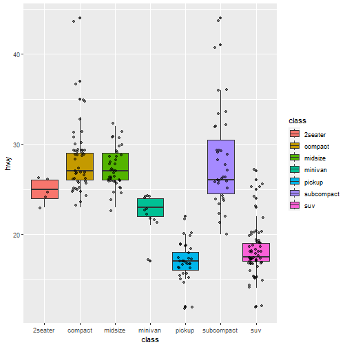
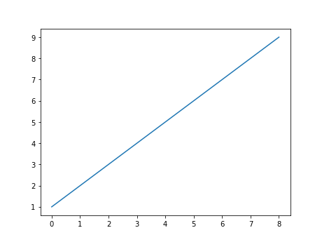
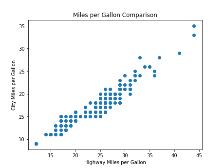

## R Markdown

This is an R Markdown document. Markdown is a simple formatting syntax for authoring HTML, PDF, and MS Word documents. For more details on using R Markdown see <http://rmarkdown.rstudio.com>.

When you click the **Knit** button a document will be generated that includes both content as well as the output of any embedded R code chunks within the document. You can embed an R code chunk like this:


```r
library(ggplot2)
df <- mpg
ggplot(data = df, aes(x = class, y = hwy)) + 
  geom_boxplot(aes(fill = class)) + 
  geom_jitter(width = 0.2, alpha = 0.5)
```



Note that the `echo = FALSE` parameter was added to the code chunk to prevent printing of the R code that generated the plot.

## Python!!!!

```python
import matplotlib.pyplot as plt
plt.plot([1,2,3,4,5,6,7,8,9])
plt.show()
```




```python
df = r.df
```


```python

import matplotlib.pyplot as plt

plt.scatter(df['hwy'], df['cty'])
plt.xlabel('Highway Miles per Gallon')
plt.ylabel('City Miles per Gallon')
plt.title('Miles per Gallon Comparison')
plt.show()
```


